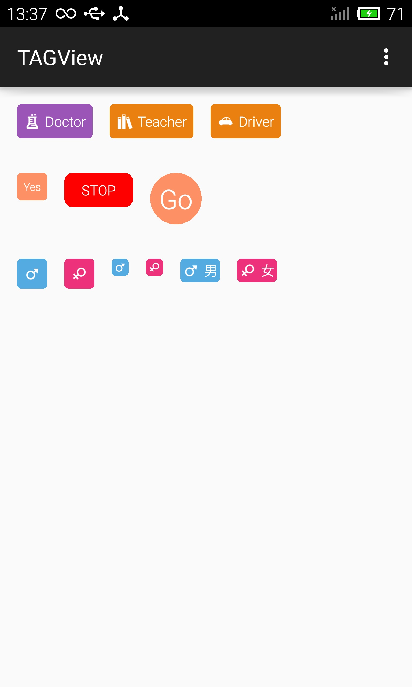

# TAGView 标签View
轻松实现标签效果。

#依赖
`compile 'com.jude:tagview:1.0.1'`

#XML

        <com.jude.tagview.TAGView
            android:layout_width="wrap_content"
            android:layout_height="wrap_content"
            app:tag_icon="@drawable/ic_doctor"  //图标      不填则无icon
            app:tag_text="TAG"                  //文字      不填则无文字
            app:tag_color="#9d55b8"             //背景颜色  默认红色
            app:tag_text_color="#ffffff"        //文字颜色  默认白色
            app:tag_text_size="13sp"            //文字大小  默认13sp
            app:tag_padding="2dp"               //内容与边缘的距离  默认4dp
            app:tag_radius="4dp"                //背景圆角半径      默认4dp
            />

所有属性均为可选，均可在代码里动态设置。

