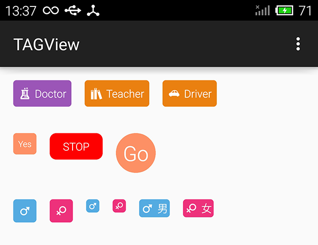

# TAGView 
Simple android view to display colorful tag efficiently.

#Dependency
`compile 'com.jude:tagview:2.1.4'`

#Usage

        <com.jude.tagview.TAGView
            android:layout_width="wrap_content"
            android:layout_height="wrap_content"
            app:tag_stroke_width="2dp"          //0 for background mode.other for border mode.
            app:tag_radius="4dp"                //radius for the background.default 4dp.
            app:tag_as_circle="true"            //show as circle
            app:tag_icon="@drawable/ic_doctor"  //If you don't set,it just like a label
            app:tag_text="TAG"                  //If you don't set,it just like a icon with background.
            app:tag_color="#9d55b8"             //background color of the TAGView.
            app:tag_text_color="#ffffff"        //text color of the label.default white.
            app:tag_text_size="13sp"            //text size of the label.default 13sp.
            app:tag_divider="2dp"               //distance between icon and text.default 4dp.
            app:tag_image_width="16dp"          //control the icon's width
            app:tag_padding="4dp"               //set padding by this
            app:tag_padding_top="4dp"
            app:tag_padding_bottom="4dp"
            app:tag_padding_left="4dp"
            app:tag_padding_right="4dp"
            />

All properties in the xml can be set in the code.

